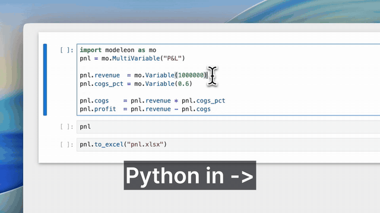

# Modeleon

[](https://pypi.org/project/modeleon/)
[](https://python.org)
[](LICENSE)
[](https://colab.research.google.com/github/modeleonai/modeleon/blob/main/notebooks/01_first_model.ipynb)

**Write Python. Ship real Excel formulas.**

> **Variable** — a value.  
> **MultiVariable** — a concept, modeled as a set of Variables and sub-concepts.  
> **Excel** — one cell-traceable snapshot of a MultiVariable.



```python
import modeleon as mo

forecast = mo.MultiVariable("Forecast")
forecast.pnl = mo.MultiVariable("P&L")
with forecast.pnl as pnl:
    pnl.revenue  = mo.Variable(1_000_000, unit="$")
    pnl.cogs_pct = mo.Variable(0.6, display_name="COGS %")
    pnl.cogs     = pnl.revenue * pnl.cogs_pct
    pnl.profit   = pnl.revenue - pnl.cogs

forecast.to_excel("forecast.xlsx")
```

The resulting `forecast.xlsx`:

|   | A         | B          |
|---|-----------|------------|
| 1 | Revenue   | `1000000`  |
| 2 | COGS %    | `0.6`      |
| 3 | Cogs      | `=B1*B2`   |
| 4 | Profit    | `=B1-B3`   |

`B3` is `=B1*B2` — a real Excel formula, not the baked value `600000`.

---

## How is this different from openpyxl / xlsxwriter / pandas?

| | Modeleon | openpyxl / xlsxwriter | pandas → Excel |
|---|---|---|---|
| Output is a live model | ✅ formulas | ⚠️ you author them as strings | ❌ values only |
| Cross-cell dependency graph | ✅ tracked automatically | ❌ | ❌ |
| Cross-sheet refs (`=Sheet!Cell`) | ✅ resolved by the engine | ⚠️ manual string concat | ❌ |
| Audit-trail per cell | ✅ every value traces back | ❌ | ❌ |

The lower stack writes spreadsheets. Modeleon writes the **model** that produces a spreadsheet — every cell, every formula, every dependency.

---

## Install

```bash
pip install modeleon
```

Python 3.12+.

---

## Variable

A value or formula. Arithmetic tracks dependencies automatically.

```python
revenue = mo.Variable(1_000_000)
cogs    = revenue * mo.Variable(0.6)
cogs.value         # 600_000.0
cogs.formula       # 'revenue * 0.6'
cogs.dependencies  # {'revenue'}
```

Scalar, list, or unit-bearing — all the same Variable.

---

## MultiVariable

A concept. Variables are its attributes; sub-MultiVariables are its inner concepts.

```python
forecast = mo.MultiVariable("Forecast")
forecast.assumptions = mo.MultiVariable("Assumptions", tax_rate=mo.Variable(0.25))
forecast.pnl = mo.MultiVariable("P&L")
forecast.pnl.revenue = mo.Variable(1_000_000)
forecast.pnl.taxes   = forecast.pnl.revenue * forecast.assumptions.tax_rate
```

> **Cross-sheet refs resolve automatically.**  
> `forecast.pnl.taxes = forecast.pnl.revenue * forecast.assumptions.tax_rate` — the engine emits `=B1 * Assumptions!B2` in Excel. Change the tax rate on Assumptions, P&L recalculates.

Reusable concepts subclass `MultiVariableClass`:

```python
class Cohort(mo.MultiVariableClass):
    def compute(self, start, churn, price):
        self.users   = mo.recurrence(start, "{prev} * (1 - {c})", c=churn)
        self.revenue = self.users * price
```

---

## Recurrence — period-over-period series

`recurrence` builds a list-valued Variable where every period references the previous period via a formula. The Excel output is a chain of cells, not a static list of values.

```python
forecast.assumptions = mo.MultiVariable("Assumptions",
    start_rev=mo.Variable(1_000_000, unit="$"),
    growth=mo.Variable([0.05] * 12),
)

forecast.pnl = mo.MultiVariable("P&L")
forecast.pnl.revenue = mo.recurrence(
    start=forecast.assumptions.start_rev,
    formula="{prev} * (1 + {growth})",
    growth=forecast.assumptions.growth,
)
```

The 12 emitted Excel cells:

```
B1: =Assumptions!B1                          (period 0 = start)
C1: =B1 * (1 + Assumptions!C2)               (compounded period 1)
D1: =C1 * (1 + Assumptions!D2)               ...
... through M1
```

Change a growth value on Assumptions — every later cell recalculates.

---

## Excel as a snapshot

`.to_excel()` walks the MultiVariable tree and writes a workbook where every Variable is a cell, every formula is `=A1*B2`, every cross-sheet reference is `=Sheet!Cell`.

Standard library functions emit live formulas, not values:

```python
mo.IRR(cf)       # =IRR(B2:F2, 0.1)
mo.NPV(0.1, cf)  # =NPV(0.1, B2:F2)
mo.IF(rev > 0, rev * 0.25, 0)   # =IF(B1>0, B1*0.25, 0)
mo.EOMONTH(start, 1)            # =EOMONTH(B1, 1)
```

Also: `IRR`, `NPV`, `XIRR`, `PMT`, `FV`, `PV` · `SUM`, `MAX`, `MIN`, `AVERAGE` · `IF`, `AND`, `OR`, `NOT` · `ABS`, `ROUND`, `INT`, `MOD` · `YEAR`, `MONTH`, `DAY`, `EDATE`, `EOMONTH`, `DATE`, `TODAY` · `CONCAT`, `UPPER`, `LOWER`, `LEN`. All emit live formulas.

---

## In a notebook

Every Variable, MultiVariable, and Model has a built-in `_repr_html_`. In Jupyter you see a live grid of values + formulas with click-to-trace-precedents — Excel's "Trace Precedents" button, in the browser. Toggle "Formulas" to flip every cell to its underlying expression.

Try it without installing anything: [Open the first-model notebook in Colab](https://colab.research.google.com/github/modeleonai/modeleon/blob/main/notebooks/01_first_model.ipynb).

---

If Modeleon resonates — a GitHub ⭐ helps more people find it.

---

## License

Apache 2.0. See [LICENSE](LICENSE) and [NOTICE](NOTICE).

**Why this exists →** [The case for Financial Model Engineering](https://modeleon.ai/blog/financial-models-should-be-engineered)

**Releases:** [CHANGELOG](CHANGELOG.md) · [GitHub releases](https://github.com/modeleonai/modeleon/releases)

[modeleon.ai](https://modeleon.ai) · [PyPI](https://pypi.org/project/modeleon/)
